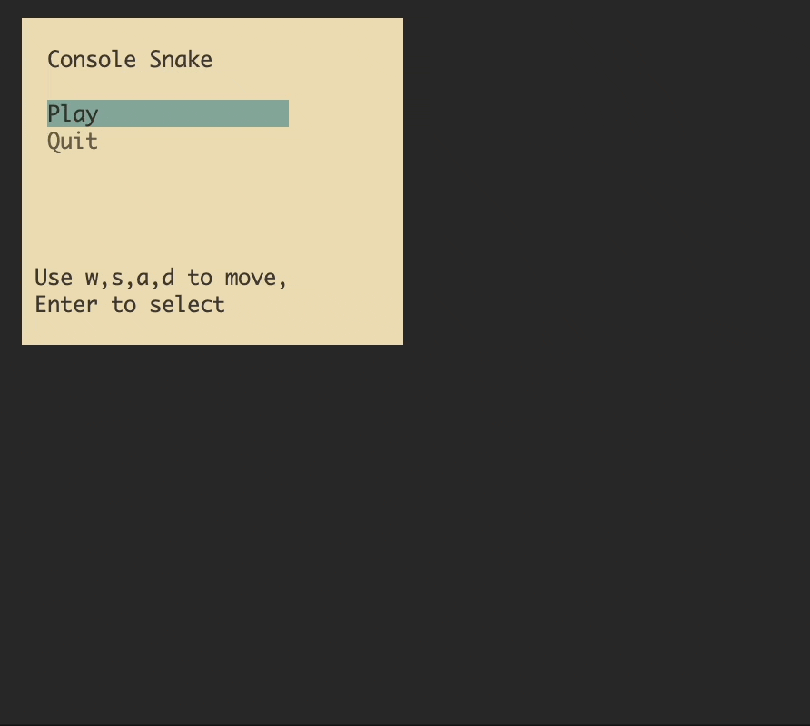

# SNAKE CONSOLE

> A simple snake game in the console using node.js



## How to play

Clone the repository

```bash
git clone https://github.com/tuanvu0995/snake-console.git
cd snake-console
npm install
npm run start
```

## Installation

Note: Currently, the game is not published to npm. You can run it by cloning the repository and running the game as mentioned above.
```bash
npm i -g snake-console
```

## Gameplay

- Challenge yourself with the "ghost" level of the game.

- Use arrow keys to control the snake
- Eat the food to grow the snake
- Avoid hitting the wall or the snake itself


## Development

Run the following command to start the development server

```bash
npm run dev
```

The game will automatically restart when you make changes to the code.

## License
MIT
